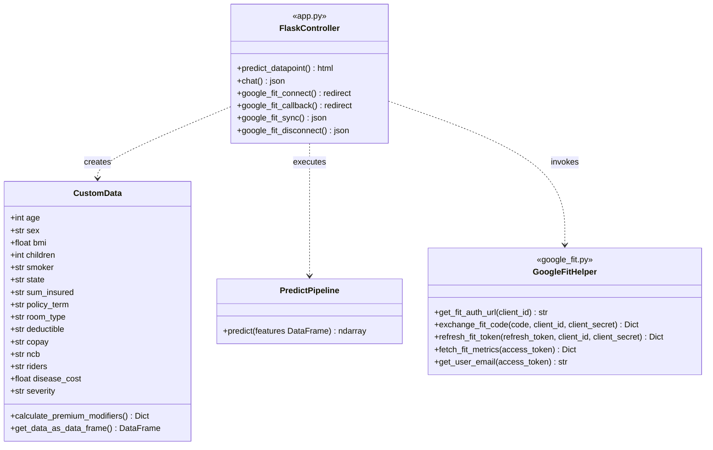
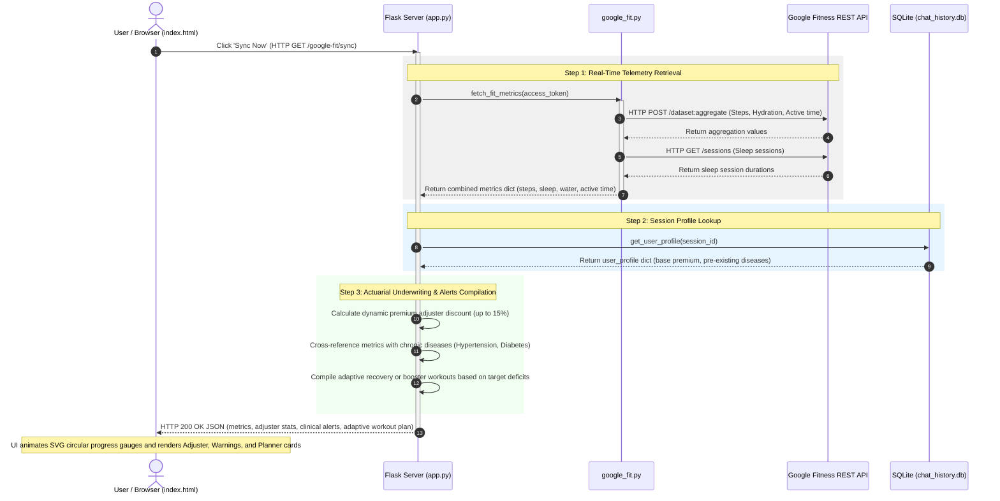

# 📊 MediSecure-AI - System Architecture & UML Diagrams

This document contains visual diagrams mapping out the high-level system architecture, the detailed object-oriented structure (UML Class Diagram), and the runtime execution flow (UML Sequence Diagram) of the MediSecure-AI project.

---

## 1. System Architecture Diagram

```mermaid
graph TB
    subgraph ClientLayer [Client Layer (Browser)]
        UI[index.html / Custom CSS / JavaScript]
        Interaction[Form Calculator, SVG Progress Rings, AI Warnings & Adjuster Panels]
    end

    subgraph ServerLayer [Server Layer - app.py]
        App[Flask Application Context]
        Routes[API Routes: /, /chat, /google-fit/connect, /google-fit/sync]
        Logger[logger.py - Event Logging]
    end

    subgraph ServiceLayer [Business Logic & Service Layer]
        PDF[medical_report_processor.py<br/>PDF Extractor & Disease Underwriter]
        ML[prediction_pipeline.py<br/>ML Inference & Premium Modifiers]
        Risk[health_risk_predictor.py<br/>Health Diagnostics & Adaptive Workout Planner]
        Fit[google_fit.py<br/>OAuth 2.0 Client & REST Telemetry Fetcher]
        Chat[gemini_chatbot.py<br/>GenAI Dialogue & local fallback]
    end

    subgraph DataLayer [Data & Models Layer]
        DB[(chat_history.db - SQLite Database)]
        ModelStore[model.pkl & preprocessor.pkl<br/>Random Forest ML Pipeline]
        Gemini[Google Gemini API]
        FitAPI[Google Fitness REST API]
    end

    %% Client and Server
    UI <-->|HTTP POST / JSON / Sync| App

    %% Server and Services
    App -->|Processes PDF reports| PDF
    App -->|Calculates ML premium| ML
    App -->|Triggers risk diagnostics & adaptive plans| Risk
    App -->|Requests OAuth code exchanges & syncs data| Fit
    App -->|Directs conversation streams| Chat

    %% Services and Data
    ML -->|Inference data preprocessing| ModelStore
    Fit <-->|Fetches steps, sleep, water, active time| FitAPI
    Chat -->|Saves dialogue threads & user profiles| DB
    Chat <-->|Invokes GenAI client| Gemini
```

---

## 2. UML Class Diagram



---

## 3. UML Sequence Diagram: Google Fit Sync & Live Underwrite

This diagram tracks the runtime execution flow when a user connects their account and clicks **Sync Now** to dynamically recalculate their premium based on behavioral telemetry:


