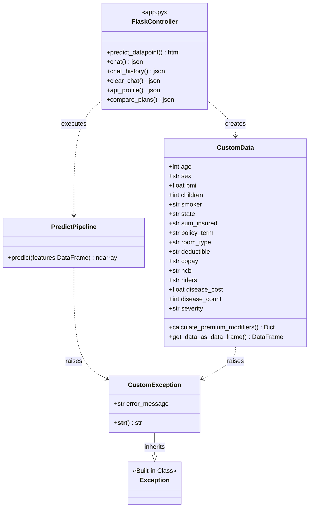
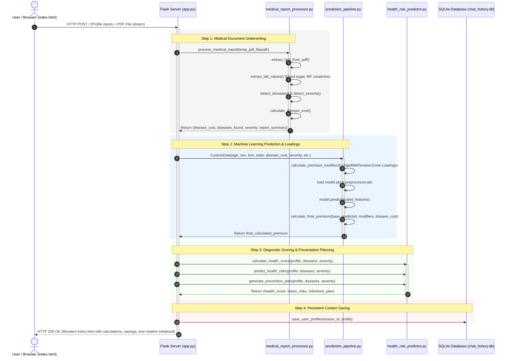

# 📊 MediSecure - System Architecture & UML Diagrams

This document contains visual diagrams mapping out the high-level system architecture, the detailed object-oriented structure (UML Class Diagram), and the runtime execution flow (UML Sequence Diagram) of the MediSecure project.

---

## 1. System Architecture Diagram
This diagram shows how different layers of the system interact, from the web UI down to the data files and external APIs.

```mermaid
graph TB
    subgraph ClientLayer [Client Layer (Browser)]
        UI[index.html / Custom CSS / JavaScript]
        Interaction[Form Submission, File Upload, Chat Widget]
    end

    subgraph ServerLayer [Server Layer - app.py]
        App[Flask Application Context]
        Routes[API Routes: /, /chat, /api/profile, /api/compare-plans]
        Logger[logger.py - Event Logging]
        Ex[exception.py - Custom Error Handling]
    end

    subgraph ServiceLayer [Business Logic & Service Layer]
        PDF[medical_report_processor.py<br/>PDF Extractor & Disease Underwriter]
        ML[prediction_pipeline.py<br/>ML Inference & Actuarial Surcharge Calculator]
        Risk[health_risk_predictor.py<br/>Health Diagnostics & Prevention Planner]
        Chat[gemini_chatbot.py<br/>Chatbot Context & AI Dialogue Manager]
    end

    subgraph DataLayer [Data & Models Layer]
        DB[(chat_history.db - SQLite Database)]
        ModelStore[model.pkl & preprocessor.pkl<br/>Serialized Random Forest & Column Transformers]
        Gemini[Google Gemini AI API<br/>gemini-2.0-flash Model]
    end

    %% Client and Server Interaction
    UI <-->|HTTP POST / JSON Requests| App

    %% Server and Services
    App -->|Reads uploaded PDF reports| PDF
    App -->|Instantiates CustomData DTO| ML
    App -->|Calculates scores & prevention plans| Risk
    App -->|Delegates conversation context| Chat

    %% Services and Data
    ML -->|Unpickles and transforms inputs| ModelStore
    Chat -->|Stores message streams & user profiles| DB
    Chat <-->|Invokes GenAI client| Gemini
```

---

## 2. UML Class Diagram
This diagram shows the static structure of classes, their fields, methods, and relationships.



---

## 3. UML Sequence Diagram
This diagram tracks a single, complete execution cycle: when a user clicks the **Calculate Premium** button on the UI, uploading a medical report along with their health parameters.


